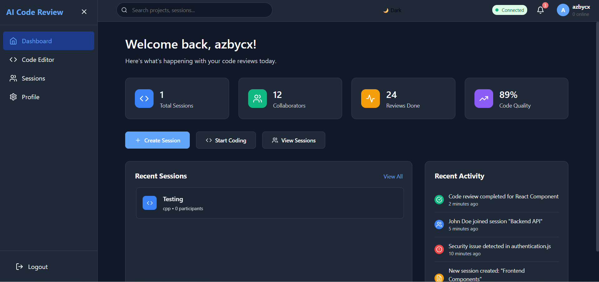
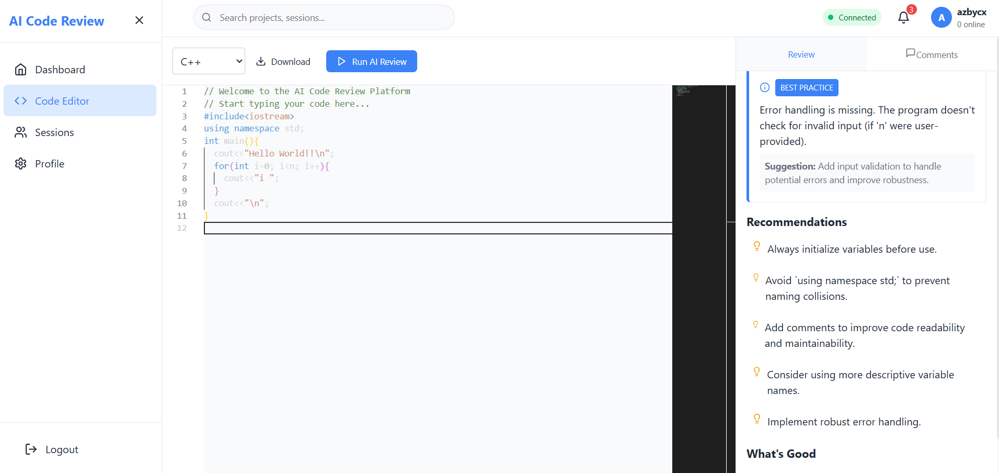
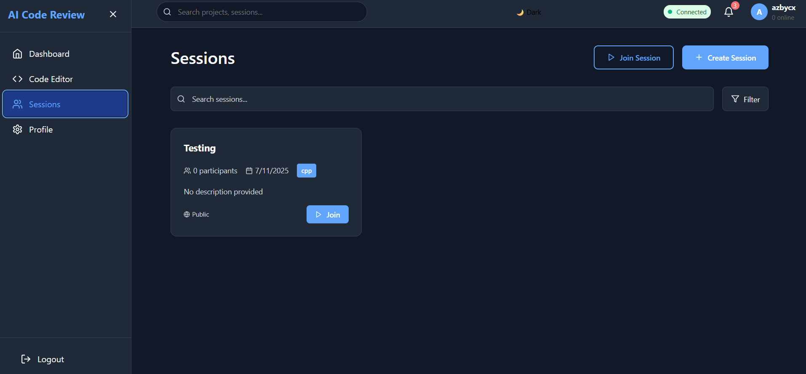

# 🤖 AI Code Reviewer

**AI-Powered Collaborative Code Review Platform** - A modern, real-time collaborative platform that leverages AI to provide intelligent code reviews, suggestions, and collaborative coding sessions.


)



## ✨ Features

### 🤖 AI-Powered Code Analysis
- **Intelligent Code Reviews** using Google Gemini AI
- **Code Quality Assessment** with detailed scoring
- **Security Vulnerability Detection**
- **Performance Optimization Suggestions**
- **Best Practices Recommendations**
- **Multi-language Support** (JavaScript, TypeScript, Python, Java, C++, HTML, CSS)

### 👥 Real-Time Collaboration
- **Live Collaborative Sessions** with Socket.IO
- **Real-time Code Editing** and synchronization
- **Session Sharing** via unique session IDs
- **Public and Private Sessions**
- **Multi-user Code Review** with comments and suggestions
- **Participant Management** and permissions

### 🎨 Modern User Interface
- **Responsive Design** with styled-components
- **Dark/Light Theme** support
- **Monaco Editor** integration for code editing
- **Real-time Notifications** with toast messages
- **Intuitive Session Management**
- **User Profile Management** with avatar support

### 🏗️ Microservices Architecture
- **API Gateway** for request routing and authentication
- **AI Service** for code analysis and review
- **Collaboration Service** for real-time features
- **Frontend** React application
- **Scalable** and maintainable architecture

## 🏗️ Architecture

```
┌─────────────────┐    ┌─────────────────┐    ┌─────────────────┐
│   Frontend      │    │   API Gateway   │    │   AI Service    │
│   (React)       │◄──►│   (Express)     │◄──►│   (Express)     │
│   Port: 3000    │    │   Port: 3001    │    │   Port: 3002    │
└─────────────────┘    └─────────────────┘    └─────────────────┘
                              │
                              ▼
                       ┌─────────────────┐
                       │ Collaboration   │
                       │   Service       │
                       │   (Express)     │
                       │   Port: 3003    │
                       └─────────────────┘
                              │
                    ┌─────────┴─────────┐
                    ▼                   ▼
              ┌──────────┐        ┌──────────┐
              │ MongoDB  │        │  Redis   │
              │Database  │        │  Cache   │
              └──────────┘        └──────────┘
```

## 🚀 Quick Start

### Prerequisites

- **Node.js** 16.0 or higher
- **MongoDB** 4.4 or higher
- **Redis** 6.0 or higher
- **npm** 8.0 or higher

### Installation

1. **Clone the repository**
   ```bash
   git clone https://github.com/yourusername/AI-Code-Reviewer.git
   cd AI-Code-Reviewer
   ```

2. **Install dependencies for all services**
   ```bash
   npm run install:all
   ```

3. **Set up environment variables**
   
   Create `.env` files in each service directory:

   **api-gateway/.env**
   ```env
   NODE_ENV=development
   PORT=3001
   MONGODB_URI=mongodb://localhost:27017/ai-code-review
   JWT_SECRET=your-super-secret-jwt-key
   REDIS_HOST=localhost
   REDIS_PORT=6379
   AI_SERVICE_URL=http://localhost:3002
   COLLABORATION_SERVICE_URL=http://localhost:3003
   FRONTEND_URL=http://localhost:3000
   ```

   **ai-service/.env**
   ```env
   NODE_ENV=development
   PORT=3002
   GEMINI_API_KEY=your-gemini-api-key
   MONGODB_URI=mongodb://localhost:27017/ai-code-review
   REDIS_HOST=localhost
   REDIS_PORT=6379
   ```

   **collaboration-service/.env**
   ```env
   NODE_ENV=development
   PORT=3003
   MONGODB_URI=mongodb://localhost:27017/ai-code-review
   REDIS_HOST=localhost
   REDIS_PORT=6379
   JWT_SECRET=your-super-secret-jwt-key
   FRONTEND_URL=http://localhost:3000
   ```

   **frontend/.env**
   ```env
   REACT_APP_API_URL=http://localhost:3001
   REACT_APP_COLLABORATION_URL=http://localhost:3003
   REACT_APP_ENVIRONMENT=development
   ```

4. **Start all services**
   ```bash
   npm start
   ```

   Or start services individually:
   ```bash
   # Terminal 1: API Gateway
   cd api-gateway && npm run dev

   # Terminal 2: AI Service
   cd ai-service && npm run dev

   # Terminal 3: Collaboration Service
   cd collaboration-service && npm run dev

   # Terminal 4: Frontend
   cd frontend && npm start
   ```

5. **Access the application**
   - Frontend: http://localhost:3000
   - API Gateway: http://localhost:3001
   - AI Service: http://localhost:3002
   - Collaboration Service: http://localhost:3003

## 📱 Usage

### Creating an Account
1. Navigate to http://localhost:3000
2. Click "Sign up" to create a new account
3. Fill in your details and click "Create Account"
4. Login with your credentials

### Starting a Code Review Session
1. Click "Create Session" on the Sessions page
2. Enter session details (name, description, language)
3. Choose to make it public or private
4. Click "Create Session"

### Joining a Session
1. **Public Sessions**: Browse and click "Join" on any public session
2. **Private Sessions**: 
   - Get the session ID from the session owner
   - Click "Join Session" and enter the session ID
   - Click "Join Session"

### Using AI Code Review
1. Open the Code Editor in any session
2. Write or paste your code
3. Click "Review Code" to get AI-powered analysis
4. Review suggestions, security issues, and optimization tips

### Real-time Collaboration
1. Share your session ID with collaborators
2. Multiple users can edit code simultaneously
3. See real-time cursors and changes
4. Add comments and suggestions
5. Chat with other participants

## 🛠️ API Documentation

### Authentication Endpoints
- `POST /api/auth/register` - Register new user
- `POST /api/auth/login` - Login user
- `POST /api/auth/logout` - Logout user
- `GET /api/auth/me` - Get current user

### Session Endpoints
- `GET /api/collaboration/sessions` - Get user sessions
- `POST /api/collaboration/sessions` - Create new session
- `GET /api/collaboration/sessions/:id` - Get specific session
- `PUT /api/collaboration/sessions/:id` - Update session
- `DELETE /api/collaboration/sessions/:id` - Delete session
- `POST /api/collaboration/sessions/:id/join` - Join session
- `POST /api/collaboration/sessions/:id/leave` - Leave session

### AI Review Endpoints
- `POST /api/ai/review` - Review code with AI
- `POST /api/ai/explain` - Get code explanation
- `POST /api/ai/review/batch` - Batch review multiple files

### User Profile Endpoints
- `GET /api/profile` - Get user profile
- `PUT /api/profile` - Update user profile
- `POST /api/profile/update` - Update profile with avatar

## 🧪 Testing

### Run All Tests
```bash
npm test
```

### Test Individual Services
```bash
# API Gateway tests
cd api-gateway && npm test

# AI Service tests
cd ai-service && npm test

# Collaboration Service tests
cd collaboration-service && npm test

# Frontend tests
cd frontend && npm test
```

### Manual Testing Scripts
```bash
# Test all functionality
.\complete-test.ps1

# Test session joining
.\test-session-join.ps1

# Test direct services
.\direct-test.ps1
```

## 🐳 Docker Support

### Using Docker Compose
```bash
# Build and start all services
docker-compose up --build

# Start in detached mode
docker-compose up -d

# Stop services
docker-compose down
```

### Individual Service Containers
```bash
# Build AI service
docker build -t ai-code-reviewer-ai ./ai-service

# Build API Gateway
docker build -t ai-code-reviewer-api ./api-gateway

# Build Collaboration service
docker build -t ai-code-reviewer-collab ./collaboration-service
```

## 📁 Project Structure

```
AI-Code-Reviewer/
├── 📁 api-gateway/          # API Gateway service
│   ├── 📁 src/
│   │   ├── 📁 middleware/   # Authentication, error handling
│   │   ├── 📁 routes/       # API routes
│   │   ├── 📁 services/     # Business logic
│   │   ├── 📁 models/       # Database models
│   │   └── 📁 utils/        # Utilities
│   └── 📄 package.json
├── 📁 ai-service/           # AI code review service
│   ├── 📁 src/
│   │   ├── 📁 routes/       # AI endpoints
│   │   ├── 📁 services/     # AI integration
│   │   └── 📁 utils/        # Helper functions
│   └── 📄 package.json
├── 📁 collaboration-service/ # Real-time collaboration
│   ├── 📁 src/
│   │   ├── 📁 socket/       # Socket.IO handlers
│   │   ├── 📁 routes/       # Session routes
│   │   ├── 📁 models/       # Session models
│   │   └── 📁 utils/        # Redis utilities
│   └── 📄 package.json
├── 📁 frontend/             # React frontend
│   ├── 📁 src/
│   │   ├── 📁 components/   # React components
│   │   ├── 📁 pages/        # Page components
│   │   ├── 📁 contexts/     # React contexts
│   │   ├── 📁 services/     # API services
│   │   └── 📁 styles/       # Styled components
│   └── 📄 package.json
├── 📄 README.md
├── 📄 package.json          # Root package.json
└── 📄 docker-compose.yml
```

## 🤝 Contributing

We welcome contributions! Please follow these steps:

1. **Fork the repository**
2. **Create a feature branch**
   ```bash
   git checkout -b feature/amazing-feature
   ```
3. **Commit your changes**
   ```bash
   git commit -m 'Add amazing feature'
   ```
4. **Push to the branch**
   ```bash
   git push origin feature/amazing-feature
   ```
5. **Open a Pull Request**

### Development Guidelines
- Follow ESLint configuration
- Write tests for new features
- Update documentation as needed
- Use conventional commit messages

## 📄 License

This project is licensed under the MIT License - see the [LICENSE](LICENSE) file for details.

## 🙏 Acknowledgments

- **Google Gemini AI** for intelligent code analysis
- **Socket.IO** for real-time collaboration
- **MongoDB** for robust data storage
- **Redis** for caching and session management
- **React** for the beautiful user interface
- **Express.js** for the backend services

## 🗺️ Roadmap

- [ ] **Code Diff Visualization**
- [ ] **Integration with Popular IDEs**
- [ ] **Advanced AI Models** (GPT-4, Claude)
- [ ] **Team Management** features
- [ ] **Code Quality Metrics** dashboard
- [ ] **Integration with GitHub/GitLab**
- [ ] **Mobile App** support
- [ ] **Advanced Security Scanning**

---

<div align="center">

**⭐ Star this repository if you find it helpful!**

Made by Keshav Laddha(https://github.com/Keshav-Laddha)

[](https://opensource.org/licenses/MIT)
[](https://nodejs.org/)
[](https://reactjs.org/)
[](https://mongodb.com/)
[](https://redis.io/)

</div>

